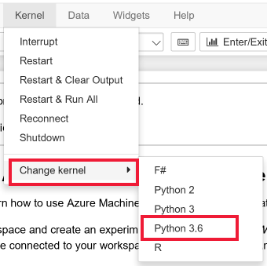

## Try with Azure Notebooks - free Jupyter based notebooks in the Azure cloud

1. 
[Import sample notebooks ](http://aka.ms/nimbusml/clone-aznotebooks) into Azure Notebooks.
1. Open one of the sample notebooks.
    
    **Make sure the Azure Notebook kernel is set to `Python 3.6`** when you open a notebook.  
    
    

## Tutorial 1: "From scikit to NimbusML"  
### Tweak existing scikit-learn scripts to use NimbusML components. To start pls run "Part1/Intro.ipynb"  

## Tutorial 2: "How much is your wine?"  
### End-2-end example of NimbusML pipeline with text processing components  

## Tutorial 3: "Spiderman vs Superman" 
### Image classification with pretrained DNN and example of cross validation technique. 
