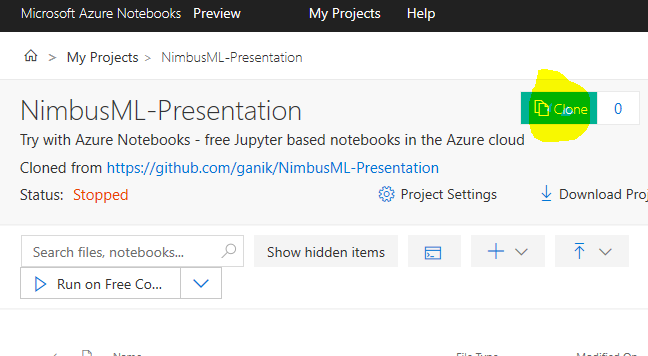

# Instructions to install Tutorial files
1. Navigate to  http://aka.ms/nimbusml-mlads2018 

2. Click “Clone” button as in pic : 

3. Follow wizard to create a free signin/signup using any Microsoft account (corporate, Outlook , Xbox etc.) 

4. Click on "Install.ipynb" :  

5. This should start your notebook, check its Python 3.6 and run “Install NimbusML” cell. Installation might take few minutes. 
       
    

6. Issues? Raise your hand 

7. While installation running pls go to folder Part1/ and start intro tutorial: 
    
    
 

# Description of Tutorials 

## Tutorial 1: "From scikit to NimbusML"  
### Tweak existing scikit-learn scripts to use NimbusML components. To start pls run "Part1/Intro.ipynb"  

## Tutorial 2: "How much is your wine?"  
### End-2-end example of NimbusML pipeline with text processing components  

## Tutorial 3: "Spiderman vs Superman" 
### Image classification with pretrained DNN and example of cross validation technique. 